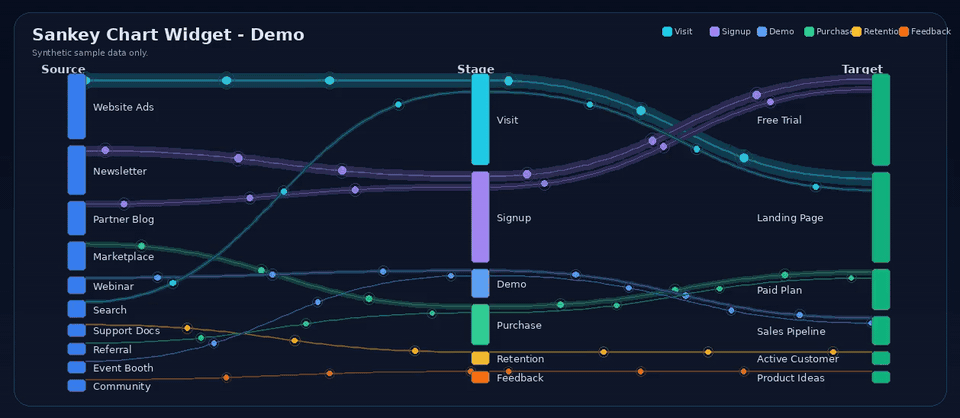

# Sankey Chart Widget

[](assets/sankey.mp4)

원본 MP4 데모 영상: [assets/sankey.mp4](assets/sankey.mp4)

`source → stage → target → value` 형식의 데이터를 움직이는 Sankey 차트로 보여주는 React Canvas 컴포넌트입니다.

표로 보면 복잡한 흐름도 Sankey 차트로 보면 “어디에서 시작해서, 어떤 단계를 거쳐, 어디로 많이 이동했는지”를 빠르게 이해할 수 있습니다. 유입 경로, 전환 퍼널, 업무 흐름, 예산 배분, 리소스 이동, 고객 여정 같은 데이터를 시각화하는 데 사용할 수 있습니다.

이 저장소는 전체 서비스가 아니라 **Sankey 차트 위젯만 분리한 독립 오픈소스 예제**입니다.

## 포함된 것

- React Canvas 기반 Sankey 차트 컴포넌트
- 공개용 샘플 데이터
- 움직이는 particle 애니메이션
- GitHub README에서 바로 볼 수 있는 데모 GIF와 MP4
- MIT 라이선스

## 포함하지 않은 것

- 실제 운영 데이터
- DB 접속 정보
- 비밀번호, API 키, 토큰
- 특정 회사 내부 정보
- 특정 서비스 전용 어댑터

## 빠른 실행

```bash
git clone https://github.com/Hostingglobal-Tech/sankey-chart-widget.git
cd sankey-chart-widget
npm install
npm run dev
```

브라우저에서 Vite가 안내하는 주소를 열면 샘플 데이터로 차트가 표시됩니다.

## 핵심 파일

```text
src/SankeyWidget.tsx   # Sankey 차트 핵심 컴포넌트
src/sankey.css         # 차트와 데모 스타일
src/sampleData.ts      # 공개용 샘플 데이터
src/App.tsx            # 데모 페이지
assets/sankey-demo.gif # GitHub README 미리보기 애니메이션
assets/sankey.mp4      # 데모 원본 영상
```

## 데이터 형식

컴포넌트는 아래 형식을 받습니다.

```ts
type FlowRow = {
  source: string; // 시작 지점
  stage: string;  // 중간 단계
  target: string; // 도착 지점
  value: number;  // 흐름의 크기
};
```

예시:

```tsx
import SankeyWidget from './SankeyWidget';

const flows = [
  { source: 'Website Ads', stage: 'Visit', target: 'Landing Page', value: 9800 },
  { source: 'Newsletter', stage: 'Signup', target: 'Free Trial', value: 7400 },
  { source: 'Marketplace', stage: 'Purchase', target: 'Paid Plan', value: 4300 },
];

export default function Page() {
  return <SankeyWidget flows={flows} dark />;
}
```

API에서 가져오게 할 수도 있습니다.

```tsx
<SankeyWidget endpoint="/api/sankey" refreshMs={5000} dark />
```

API 응답은 배열 형식 또는 객체 형식을 모두 지원합니다.

```json
{
  "columns": ["source", "stage", "target", "value"],
  "rows": [
    ["Website Ads", "Visit", "Landing Page", 9800],
    ["Newsletter", "Signup", "Free Trial", 7400]
  ]
}
```

또는:

```json
[
  { "source": "Website Ads", "stage": "Visit", "target": "Landing Page", "value": 9800 },
  { "source": "Newsletter", "stage": "Signup", "target": "Free Trial", "value": 7400 }
]
```

## 동작 방식

1. 입력 데이터를 `source`, `stage`, `target` 기준으로 집계합니다.
2. 3개 열의 노드 위치와 높이를 계산합니다.
3. 값이 큰 흐름은 더 두껍게 표시합니다.
4. 곡선 링크를 그리고, 링크 위에 움직이는 점을 표시합니다.
5. 하단 표에는 현재 표시 중인 데이터를 함께 보여줍니다.

## 커스터마이징

단계별 색상은 `src/SankeyWidget.tsx`의 `STAGE_COLORS`에서 바꿀 수 있습니다.

```ts
const STAGE_COLORS = {
  Visit: '#22d3ee',
  Signup: '#a78bfa',
  Purchase: '#34d399',
};
```

한 번에 보여줄 행 수는 `maxFlows`로 조정합니다.

```tsx
<SankeyWidget flows={flows} maxFlows={50} />
```

밝은 테마는 `dark={false}`로 사용합니다.

```tsx
<SankeyWidget flows={flows} dark={false} />
```

제목은 `title`로 바꿀 수 있습니다.

```tsx
<SankeyWidget flows={flows} title="월간 전환 흐름" />
```

## 보안과 공개 범위

이 저장소의 샘플 데이터와 데모 영상은 모두 공개용 더미 데이터입니다.

이 저장소에는 다음을 넣지 않았습니다.

- 실제 고객 데이터
- 실제 업무 데이터
- DB 연결 문자열
- 계정 정보
- API 키
- 비밀번호
- 토큰

실제 서비스를 연결할 때는 서버 쪽에서 필요한 데이터를 `source`, `stage`, `target`, `value` 형식으로 변환해서 이 컴포넌트에 전달하면 됩니다. 민감한 값은 프론트엔드 저장소에 넣지 말고, 서버 환경변수나 별도 비밀정보 저장소에서 관리하십시오.

## Q&A

### Q. 특정 제품이나 특정 시스템 전용인가요?

아닙니다. 이 저장소는 독립적인 Sankey 차트 위젯입니다. 입력 데이터 형식만 맞추면 어느 시스템에서도 사용할 수 있습니다.

### Q. 백엔드가 꼭 필요한가요?

아닙니다. `flows` props로 데이터를 직접 넣으면 백엔드 없이도 동작합니다. 실시간 갱신이 필요할 때만 `endpoint`를 사용하면 됩니다.

### Q. 실제 데이터가 포함되어 있나요?

아니요. 샘플 데이터와 데모 영상은 모두 공개용 예시입니다.

### Q. DB나 API 키가 들어 있나요?

아니요. 이 저장소에는 DB 접속 정보, API 키, 비밀번호, 토큰이 없습니다.

### Q. 상용 프로젝트에 써도 되나요?

가능합니다. MIT 라이선스라 개인, 회사, 상용, 비상용 모두 자유롭게 사용할 수 있습니다. 단, 라이선스 고지는 유지하십시오.

### Q. 무엇을 더 개선하면 좋을까요?

아래 개선을 환영합니다.

- 더 정교한 레이아웃 알고리즘
- 노드 클릭/필터 기능
- 확대/축소 기능
- 모바일 화면 최적화
- 접근성 개선
- 테스트 코드 추가
- 다양한 차트 테마

## 라이선스

MIT License.
